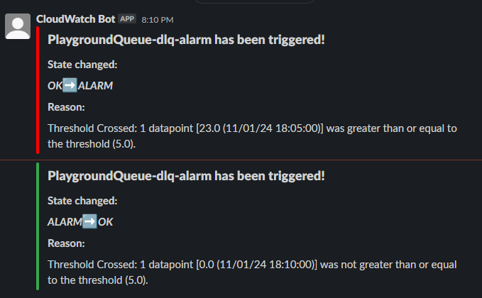

# sqs-dlq-monitoring

- [sqs-dlq-monitoring](#sqs-dlq-monitoring)
- [Getting Started](#getting-started)
  - [Example](#example)
    - [Install the package with npm:](#install-the-package-with-npm)
    - [Install the package with yarn:](#install-the-package-with-yarn)
    - [Import the construct into your stack:](#import-the-construct-into-your-stack)
- [Why?](#why)
- [API](#api)
  - [`queueProps`](#queueprops)
  - [`maxReceiveCount`](#maxreceivecount)
  - [`messageThreshold`](#messagethreshold)
  - [`evaluationThreshold`](#evaluationthreshold)
  - [`messagingProviders`](#messagingproviders)
    - [1. `EmailProvider`](#1-emailprovider)
    - [2. `SlackProvider`](#2-slackprovider)
- [Deployed Infrastructure](#deployed-infrastructure)
- [Setting up Email notifications](#setting-up-email-notifications)
  - [`EmailProvider`](#emailprovider)
  - [Example](#example-1)
- [Setting up Slack notifications](#setting-up-slack-notifications)
  - [Slack App](#slack-app)
  - [`SlackProvider`](#slackprovider)
    - [`slackToken`](#slacktoken)
    - [`slackChannel`](#slackchannel)
  - [Example](#example-2)
- [Contributing](#contributing)
  - [How to get started with local development?](#how-to-get-started-with-local-development)
    - [Tips](#tips)
      - [Create a "Playground" environment](#create-a-playground-environment)
- [Credits](#credits)

This is an AWS CDK construct which creates an AWS Simple-Queue Service (SQS) queue with an appropriately monitored Dead-Letter Queue (DLQ).

Based on the configuration, this so called `MonitoredQueue` construct will send messages to the specified locations to notify you if messages in the DLQ cross a certain threshold.

The following messaging locations are available:

- Email
- Slack

---

# Getting Started

## Example

Here is an example for how to use this construct in your AWS CDK TypeScript project.

After setting up your AWS CDK app.

### Install the package with npm:

`npm install sqs-dlq-monitoring`

### Install the package with yarn:

`yarn add sqs-dlq-monitoring`

### Import the construct into your stack:

```ts
export class ShowcaseStack extends cdk.Stack {
  constructor(scope: Construct, id: string, props?: cdk.StackProps) {
    super(scope, id, props);

    ...

    new MonitoredQueue(this, 'MonitoredQueue', {
      queueProps: {
        queueName: 'ShowcaseQueue',
        visibilityTimeout: cdk.Duration.seconds(300),
      },
      messagingProviders: [
        new EmailProvider([
          'coolemail@example.com',
          'coolemail2@example.com'
         ]),
        new SlackProvider('example_123', 'C012345', 'Example1'),
      ],
    });
  }
}
```

---

# Why?

SQS is a common part of most AWS infrastructures, and it is recommended to deploy a DLQ alongside it to catch any failed messages.

The problem is that a DLQ can only keep messages for a time of up to 14 days, and if this DLQ is not monitored, developers may not know that any messages have failed.

These messages would then be deleted at the end of the retention period.

This package aims to solve this problem by granting developers an easy way to deploy a solution to monitor and notify them if messages have failed.

Sources:

- https://docs.aws.amazon.com/AWSSimpleQueueService/latest/SQSDeveloperGuide/sqs-dead-letter-queues.html#sqs-dead-letter-queues-benefits
- https://medium.com/lumigo/sqs-and-lambda-the-missing-guide-on-failure-modes-7e31644d8722#:~:text=SQS%20with%20Lambda.-,No%20DLQs,-The%20most%20common

---

# API

## `queueProps`

The standard properties of the SQS Queue Construct.

You can also use this property to override the default values for the deadLetterQueue.

Example:

```ts
new MonitoredQueue(stack, 'ExampleQueue', {
  queueProps: {
    queueName: 'Example-123',
    deadLetterQueue: {
      queue: new Queue(stack, 'DLQ', {
        queueName: 'custom-dlq',
      }),
      maxReceiveCount: 3,
    },
  },
  messageProviders: [
    ...
  ]
});
```

## `maxReceiveCount`

The number of times a message can be unsuccesfully dequeued before being moved to the dead-letter queue.

## `messageThreshold`

The threshold for the amount of messages that are in the DLQ which trigger the alarm

## `evaluationThreshold`

The number of periods over which data is compared to the specified threshold.

## `messagingProviders`

A list of messaging providers which will each be deployed as a destination for your messages.

The options are listed below:

### 1. `EmailProvider`

Sets up Email Messaging

For info on setting this up see:

[Setting Up Email Notifications](#setting-up-email-notifications)

### 2. `SlackProvider`

Sets up Slack Messaging

For info on setting this up see:

[Setting Up Slack Notifications](#setting-up-slack-notifications)

---

# Deployed Infrastructure

To support this construct the following infrastucture is deployed:

- SQS Queue
- SQS DLQ
- SNS Topic
- CloudWatch Alarm
- Lambda Function

A representation of the infrastructure can be seen below.


---

# Setting up Email notifications

When using the construct the following parameter is used for setting up a Email notifications:

- [`messagingProviders`](#messagingproviders)

The `messagingProviders` parameter requires a list of messaging providers of which one option is `EmailProvider`

## `EmailProvider`

The email provider has a single parameter:

`emails`

Which expects a list of email addresses.

These email addresses will be sent a "Subscription" email from AWS, which needs to be accepted.

Be sure to check your spam folder

## Example

```ts
{
  ...
  messagingProviders: [
    new EmailProvider(['testemail@test.com'])
  ],
  ...
};
```

---

# Setting up Slack notifications

When using the construct the following parameter is used for setting up a Email notifications:

- [`messagingProviders`](#messagingproviders)

The `messagingProviders` parameter requires a list of messaging providers of which one option is `SlackProvider`

First you need to setup a Slack App to obtain the necessary information:

## Slack App

To setup this feature, a Slack App needs to be created and added to the desired workspace which will provide the method for generating a token and providing the correct access for the Lambda Function.

A guide to do so can be found here https://api.slack.com/start/quickstart

## `SlackProvider`

The `SlackProvider` contains parameters for setting up Slack Messaging.

### `slackToken`

A Bot User token which will be provided to the `slackToken` parameter.

The token requires the following scopes:

- `chat.write`
- `chat.write.public`

See [Slack App](#slack-app)

### `slackChannel`

A channel that the bot will send messages to.

The channel ID needs to be used as the `slackChannel` parameter.

After being set up successfully you will receive messages that look like this when the alarm is triggered:



See [Slack App](#slack-app)

## Example

```ts
{
  ...
  messagingProviders: [
    new SlackProvider('example_123', 'C012345', 'Example1'),
    new SlackProvider('example_345', 'C543210', 'Example2'),
  ],
  ...
}
```

---

# Contributing

Feel free to create Issues and PR's if you want to contribute to the project!

## How to get started with local development?

1. Clone the project onto your local machine.

2. Run `yarn` to install dependencies

3. Run `yarn build` to compile the project

4. Implement your changes

5. Ensure your changes are tested with `yarn test`

6. Create an Issue and associate your PR with the issue

7. Be sure to document your changes appropriately

### Tips

#### Create a "Playground" environment

1. Create a folder in the root called `playground`

2. Initialise your preffered CDK app

3. Import the package from the `lib/` path in the root.

4. Deploy to your personal AWS account to test

# Credits

Special thanks to the following persons / organisations who helped out directly and indirectly throughout the process.

- Symbiotics Application Services (https://symbiotics.co.za/)
  - Provided the environment and support for the initial development of the idea, and kindly allowed me to recreate this publicly.
- @rehanvdm (https://github.com/rehanvdm)
  - Provided initial inspiration indirectly, and then later helped directly by doing some code review.
- @geekmidas (https://github.com/geekmidas)
  - Motivating me to do this, and mentoring in general.
  - Provided code-review.
- Side-Project Society Discord Server members
  - A discord server set up to motivate each other to work on side-projects like this.
  - The discord server is invaluable to keep me motivated during the process.
