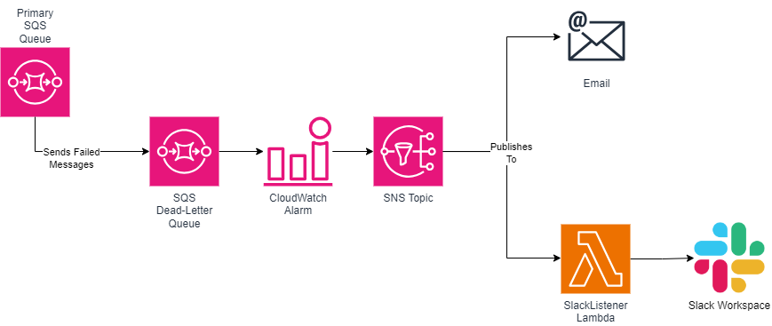

# sqs-dlq-monitoring
An AWS CDK construct to wrap AWS Simple-Queue Service (SQS) Dead-Letter Queues with a CloudWatch alarm to notify if the number of messages cross a certain threshold.

The following integrations are available:

- Email
- Slack

More coming soon!

# Deployed Infrastructure

To support this construct the following infrastucture is deployed:

- SQS Queue
- SQS DLQ
- SNS Topic
- CloudWatch Alarm
- Lambda Function

A representation of the infrastructure can be seen below.

# Setting up an Email notification

A list of emails can be provided to the `emails` parameter. 

Please note that a subscription request will be sent out to each email which needs to be accepted. Be sure to check you Spam folder as well.

# Setting up a Slack notification
When using the construct the following parameters are available for setting up a Slack notification

`slackToken`
`slackChannel`

To setup this feature, a Slack App needs to be created and added to the desired workspace.

A guide to do so can be found here https://api.slack.com/start/quickstart

## Requirements

- A Bot User token which will be provided to the `slackToken` parameter. The token requires the following scopes: `chat.write` and `chat.write.public`

- A channel that the bot can send messages to. The channel ID needs to be used as the input for the `slackChannel` parameter.
